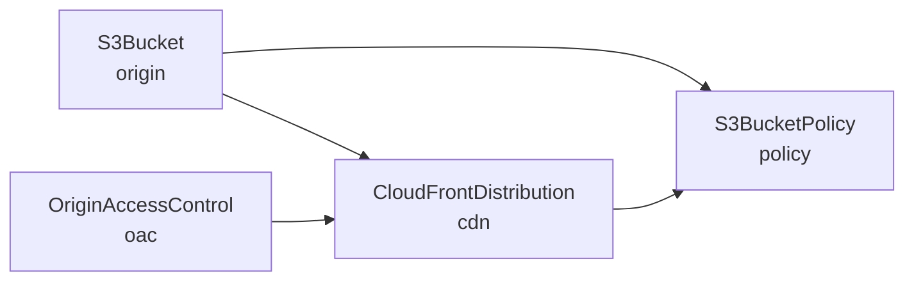

# aws-static-website

[](https://github.com/atlantide-org/aws-static-website/actions/workflows/ci.yml)

A published [Atlantide](https://github.com/atlantide-org/atlantide) L2 component that
provisions a static website on AWS: a private S3 origin bucket fronted by a CloudFront
distribution, secured with an Origin Access Control (OAC) so the bucket is reachable
only through the CDN.

Fetched from git, pinned to a commit and content hash, and imported by configuration
as `atlantide.components.aws_static_website`.

---

## Contents

- [Overview](#overview)
- [Requirements](#requirements)
- [Installation](#installation)
- [Usage](#usage)
- [API](#api)
- [Behaviour](#behaviour)
- [Operations](#operations)
- [Limitations](#limitations)
- [Development](#development)

## Overview

`StaticWebsite` expands into four resources on a single call:

| Child | Type | Role |
|-------|------|------|
| `origin` | `S3Bucket` | Private origin bucket; never publicly readable. |
| `oac` | `OriginAccessControl` | Signs CloudFront's requests to the bucket (SigV4). |
| `cdn` | `CloudFrontDistribution` | The CDN fronting the bucket; serves the site. |
| `policy` | `S3BucketPolicy` | Grants `s3:GetObject` to the distribution alone, scoped by `AWS:SourceArn`. |

References wire the dependency graph automatically; nothing needs an explicit
`depends_on`:



The origin bucket and the OAC are independent, so they reconcile in parallel. The site
is served from the default `*.cloudfront.net` domain — no custom domain, ACM
certificate, or Route 53 record is required.

## Requirements

- Python ≥ 3.11
- Atlantide ≥ 0.1.0
- AWS credentials with permission to manage S3 and CloudFront. LocalStack works via
  `aws_endpoint` in `atlantide.toml`.

## Installation

Add the component to an Atlantide project. This resolves the reference to a commit,
records it in `atlantide.lock`, and vendors the package under `.atlantis/`:

```bash
atlantide component add https://github.com/<owner>/aws-static-website --ref v1 --subdir src
```

The command writes the source to `atlantide.toml`:

```toml
[components.aws_static_website]
git    = "https://github.com/<owner>/aws-static-website"
ref    = "v1"
subdir = "src"
```

Commit `atlantide.lock`; git-ignore `.atlantis/` — it is derived, and `vendor`
rebuilds it from the lock alone.

## Usage

```python
# site.py
from atlantide.core import Stack, output
from atlantide.components.aws_static_website import StaticWebsite
from atlantide.providers.aws import Region

with Stack("site", region=Region.UsEast1, name_prefix="acme", tags={"app": "www"}):
    site = StaticWebsite(
        "web",
        bucket="acme-www",
        default_root_object="index.html",
        comment="marketing site",
    )
    output("site_url", site.url)
    output("bucket", site.bucket)
    output("distribution_id", site.distribution_id)
```

```bash
atlantide plan  site.py --state site.db   # preview
atlantide apply site.py --state site.db   # reconcile
atlantide apply site.py --state site.db   # re-run: all NOOP, zero provider calls

aws s3 cp index.html s3://acme-www/       # upload content
```

A minimal site needs one argument:

```python
StaticWebsite("web", bucket="acme-www")
```

## API

### `StaticWebsite(name, *, ...)`

| Parameter | Type | Default | Description |
|-----------|------|---------|-------------|
| `name` | `str` | — | Logical name; children namespace under it (e.g. `web-origin`). |
| `bucket` | `str` | — | Globally unique origin-bucket name. |
| `region` | `str \| None` | Stack region | Origin-bucket region; falls back to the enclosing `Stack`. CloudFront and the OAC are global. |
| `default_root_object` | `str` | `"index.html"` | Object served for a request to `/`. |
| `comment` | `str` | `""` | Distribution comment, shown in the CloudFront console. |
| `versioning` | `bool` | `False` | S3 object versioning on the origin bucket. |

Raises `RegistryError` when no region can be resolved — pass `region=` or instantiate
inside a `Stack`.

### Attributes

| Attribute | Resolves | Description |
|-----------|----------|-------------|
| `bucket` | at compile | The origin bucket's name. |
| `url` | at apply | The distribution's `*.cloudfront.net` domain (a `Ref`). |
| `arn` | at apply | The **distribution** ARN, not the bucket's. |
| `distribution_id` | at apply | The CloudFront distribution id, for cache invalidations. |

The child handles — `origin`, `oac`, `cdn`, `policy` — are exposed for wiring further
resources (e.g. an `S3Folder` that syncs content into `origin`).

## Behaviour

What a second `plan` does after a change:

| Change | Result |
|--------|--------|
| None | Every node `NOOP` — Merkle-skipped, zero provider calls. |
| `default_root_object`, `comment` | In-place `UPDATE` of the distribution. |
| `versioning` | `UPDATE` of the origin bucket; the distribution takes a *conditional* `REPLACE` (see below). |
| `bucket` renamed | `REPLACE` of the origin bucket and its policy; conditional `REPLACE` of the distribution. |
| `region` changed | `REPLACE` of the origin bucket (region is immutable); conditional `REPLACE` of the distribution. |

**Conditional replace.** The distribution's `origin_domain` is immutable and carries a
`Ref` to the bucket's `regional_domain_name`, which is only known after apply. Any
change to the bucket therefore plans as a *conditional* `REPLACE` of the distribution:
if the resolved domain turns out unchanged, it collapses to a no-op rather than
rebuilding the CDN. Read `plan` output before applying a bucket change.

The config is a deterministic sandbox: two evaluations lower to byte-identical IR.

## Operations

Reproduce the vendored tree on another machine or in CI:

```bash
atlantide component vendor   # rebuild .atlantis/ from atlantide.lock
atlantide component verify   # re-hash the vendored tree against the lock (tamper/drift)
```

Publish content by uploading to the origin bucket (`aws s3 cp`, or an `S3Folder`
resource wired to `site.bucket` for a mirrored directory). CloudFront caches
aggressively under the AWS-managed *CachingOptimized* policy — invalidate with
`site.distribution_id` after a release.

**Teardown is slow.** A CloudFront distribution must be disabled and fully redeployed
before it can be deleted, so `atlantide destroy` can take 15–20 minutes.

## Limitations

- **Default CloudFront domain only.** Custom domains, ACM certificates, and Route 53
  records are out of scope; the site is served from `*.cloudfront.net`.
- **Single S3 origin, fixed CDN behaviour.** The origin type and signing mode are
  pinned to the S3 static-site shape (`s3` / `always` / `sigv4`), and the cache policy
  to AWS-managed *CachingOptimized*. Multiple origins, custom cache policies, error
  pages, functions, and logging are not exposed.
- **Content is not managed here.** The component provisions the delivery path; upload
  is a separate step.
- **Bucket encryption and public-access block are not configurable.** They are not
  fields on the AWS provider's `S3Bucket`, so apply them out of band if your
  environment requires them. Public reads are already blocked by the OAC-scoped policy.

## Development

```
aws-static-website/
├── src/__init__.py   # the StaticWebsite component (the vendored package)
├── tests/            # expansion, namespacing, ref wiring, graph edges
└── pyproject.toml
```

On fetch, Atlantide copies `src/` into `.atlantis/components/aws_static_website/` and
mounts it so `atlantide.components.aws_static_website` resolves.

```bash
uv sync
uv run pytest        # 13 tests
uv run mypy src
uv run ruff check .
```

CI runs the same checks on Python 3.11, 3.12, and 3.13.
